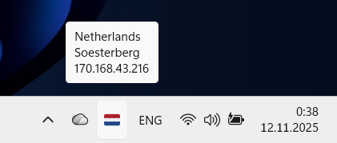

# My IP in system tray

Show IP information in system tray.

# Screenshot
* Flag in tray 
* IP Info on mouse hover
* Quit by right click menu



#### Run

```bash
pip install -r requirements.txt
python main.py
```

#### How to add it to "Startup apps" in Windows
* Run `pip install pyinstaller`
* Build `.exe` yourself by run `build.bat`
* Copy `.exe` file to startup directory:
  ```
  C:\Users\%USERNAME%\AppData\Roaming\Microsoft\Windows\Start Menu\Programs\Startup
  ```